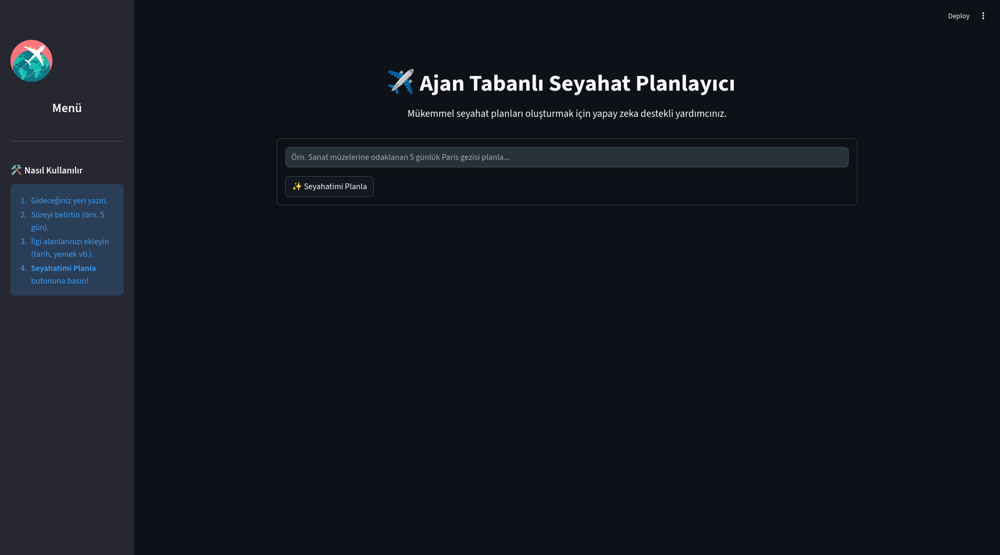

# ✈️ Ajan Tabanlı Seyahat Planlayıcı (AI Trip Planner)

Bu proje, kullanıcıların tercihlerine, bütçelerine ve ilgi alanlarına göre kişiselleştirilmiş seyahat planları oluşturan yapay zeka destekli bir uygulamadır. Google Gemini modelleri ve LangGraph kullanılarak geliştirilen bu asistan, seyahatinizi en ince ayrıntısına kadar planlamanıza yardımcı olur.


*Uygulama ana ekranından bir görünüm.*

## 🌟 Özellikler

*   **Kişiselleştirilmiş Planlama:** Gideceğiniz yer, süre ve ilgi alanlarınıza göre size özel rotalar oluşturur.
*   **Akıllı Araçlar:**
    *   🌤️ **Hava Durumu:** Gideceğiniz tarihlerdeki hava durumunu kontrol eder.
    *   🔍 **Mekan Arama:** İlgi alanlarınıza uygun turistik yerleri, restoranları ve aktiviteleri bulur.
    *   💰 **Bütçe Hesaplama:** Tahmini harcamaları hesaplar.
    *   💱 **Para Birimi Çevirme:** Güncel kurlarla maliyet analizi yapar.
*   **Kullanıcı Dostu Arayüz:** Streamlit ile geliştirilmiş modern ve anlaşılır bir arayüz sunar.
*   **Etkileşimli Deneyim:** Seyahat planınızı adım adım oluştururken size rehberlik eder.

## 🏗️ Mimari ve Tasarım

Proje, **LangGraph** mimarisi üzerine kurgulanmış modüler bir yapıya sahiptir.

### 🔄 Ajan İş Akışı (Agent Workflow)

Ajan, döngüsel bir grafik (graph) yapısı üzerinde çalışır:
1.  **START -> Agent**: Akış başlar ve `agent` düğümü çalıştırılır.
2.  **Agent (Karar Mekanizması)**: LLM, mevcut mesaj geçmişini (`MessagesState`) analiz eder.
    *   Eğer bir araç kullanımına ihtiyaç duyarsa -> `tools` düğümüne yönlendirir.
    *   Eğer yanıt hazırsa -> `END` düğümüne yönlendirir.
3.  **Tools (Araç Katmanı)**: İlgili araç (Hava durumu, Arama vb.) çalıştırılır ve sonuç tekrar `agent` düğümüne gönderilir.

### 💾 Durum Yönetimi (State Management)

Uygulamanın durumu, `langgraph.graph.MessagesState` şeması ile yönetilir. Bu şema, kullanıcı ve asistan arasındaki tüm konuşma geçmişini (mesajlar listesi) tutar. Her adımda bu liste güncellenir ve yeni kararlar için modelin bağlamı korunur.

### 🛠️ Teknik Araçlar (Tools)

Ajanın yeteneklerini genişleten `ToolNode` bileşenleri:
*   `WeatherInfoTool`: OpenWeatherMap API ile anlık hava durumu verisi çeker.
*   `PlaceSearchTool`: Google Places ve Foursquare API'leri ile mekan/aktivite keşfi yapar.
*   `CalculatorTool`: Bütçe hesaplamaları için matematiksel işlemler yapar.
*   `CurrencyConverterTool`: Döviz kurları için maliyet dönüşümü sağlar.

## �️ Kurulum

Projenizi yerel ortamınızda çalıştırmak için aşağıdaki adımları izleyin:

1.  **Depoyu Klonlayın:**
    ```bash
    git clone https://github.com/darkrange1/ai-trip-planner.git
    cd ai-trip-planner
    ```

2.  **Sanal Ortam Oluşturun (Önerilen):**
    ```bash
    python -m venv venv
    # Windows için:
    venv\Scripts\activate
    # macOS/Linux için:
    source venv/bin/activate
    ```

3.  **Gerekli Kütüphaneleri Yükleyin:**
    ```bash
    pip install -r requirements.txt
    ```

4.  **Çevresel Değişkenleri Ayarlayın:**
    Kök dizinde `.env` dosyası oluşturun ve gerekli API anahtarlarını ekleyin (örneğin Google API Key, Serper API Key vb.):
    ```env
    GOOGLE_API_KEY=sizin_api_anahtariniz
    TAVILAY_API_KEY=sizin_tavily_api_anahtariniz
    OPENWEATHERMAP_API_KEY=sizin_weather_api_anahtariniz
    EXCHANGE_RATE_API_KEY=sizin_exchange_rate_api_anahtariniz
    FOURSQUARE_API_KEY=sizin_fourquare_api_anahtariniz
    GPLACES_API_KEY=sizin_google_places_api_anahtariniz
    ```


## � Docker ile Çalıştırma

Uygulamayı Docker ile konteyner içinde çalıştırmak isterseniz:

1.  **Docker İmajını Oluşturun:**
    ```bash
    docker build -t ai-trip-planner .
    ```


2.  **Docker Ağı Oluşturun (Önerilen):**
    Backend ve Frontend konteynerlerinin birbirini görebilmesi için bir ağ oluşturun:
    ```bash
    docker network create trip-network
    ```

3.  **Uygulamayı Başlatın:**

    *   **Backend (API) İçin:**
        ```bash
        docker run -d -p 8000:8000 --env-file .env --network trip-network --name trip-backend ai-trip-planner
        ```

    *   **Frontend (Streamlit) İçin:**
        `API_URL` ortam değişkeni ile backend adresini (backend konteyner ismini) belirtin:
        ```bash
        docker run -d -p 8501:8501 --env-file .env --network trip-network --env API_URL=http://trip-backend:8000 --name trip-frontend ai-trip-planner streamlit run streamlit_app.py
        ```
    

### 🛑 Durdurma ve Temizleme

Eğer konteynerleri durdurmak veya "name already in use" (isim kullanımda) hatası alırsanız şu komutu çalıştırarak temizlik yapabilirsiniz:

```bash
docker rm -f trip-backend trip-frontend
```

## �🚀 Kullanım

Kurulum tamamlandıktan sonra uygulamayı çalıştırmak için **iki ayrı terminal** kullanmanız gerekmektedir (Docker kullanmıyorsanız).

1.  **Backend (Sunucu) Başlatma:**
    İlk terminalde API sunucusunu başlatın:
    ```bash
    uvicorn main:app --reload
    ```
    Bu komut, backend servisinin `http://localhost:8000` adresinde çalışmasını sağlar.

2.  **Frontend (Arayüz) Başlatma:**
    İkinci bir terminal açın ve uygulamanın arayüzünü başlatın:
    ```bash
    streamlit run streamlit_app.py
    ```

3.  **Kullanım:**
    Tarayıcınızda otomatik olarak açılan sayfada (genellikle `http://localhost:8501`):
    *   Kenar çubuğundaki menüyü inceleyin.
    *   Ana ekrandaki kutucuğa seyahat isteğinizi yazın (örneğin: *"Paris'e 3 günlük sanat ve gastronomi gezisi planla"*).
    *   **"Seyahatimi Planla"** butonuna tıklayın ve yapay zekanın sihrini izleyin!


## 📂 Proje Yapısı

Projenin temel dosya ve klasör yapısı şöyledir:

```text
AI_Trip_Planner/
├── agent/                  # Ajanın mantığı ve iş akışı (LangGraph)
│   └── agentic_workflow.py
├── tools/                  # Ajanın kullandığı araçlar.
│   ├── place_search_tool.py
│   ├── weather_info_tool.py
│   ├── expense_calculator_tool.py
│   └── ...
├── utils/                  # Yardımcı fonksiyonlar ve model yükleyici
├── prompt_library/         # Prompt şablonları
├── streamlit_app.py        # Ana uygulama arayüzü (Streamlit)
├── requirements.txt        # Python bağımlılıkları
├── Dockerfile              # Konteynerleştirme yapılandırması
└── README.md               # Proje dokümantasyonu.
```

## 🤖 Nasıl Çalışır?

Bu proje, **LangGraph** kütüphanesini kullanarak durum tabanlı bir ajan (stateful agent) oluşturur.
1.  Kullanıcıdan gelen istek `streamlit_app.py` üzerinden alınır.
2.  `agentic_workflow.py` içindeki ajan, isteği analiz eder.
3.  Gerekli durumlarda `tools/` altındaki araçları (hava durumu, arama vb.) çağırarak bilgi toplar.
4.  Toplanan bilgiler ve LLM'in (Large Language Model) yetenekleri birleştirilerek kapsamlı bir yanıt oluşturulur.
5.  Sonuç, kullanıcıya düzenli bir formatta sunulur.

 
*Ajanın karar verme ve işlem akış şeması.*

